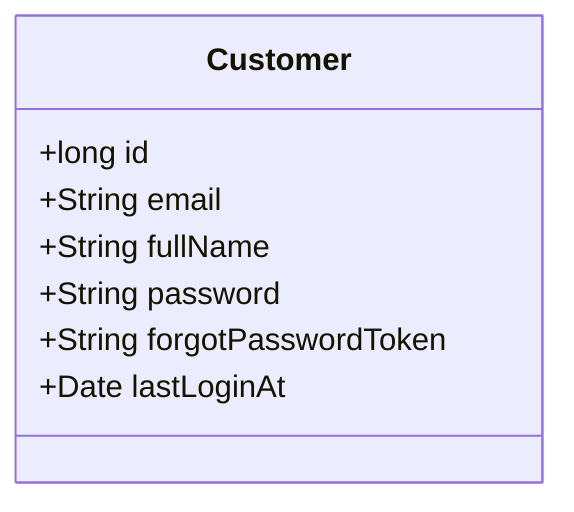
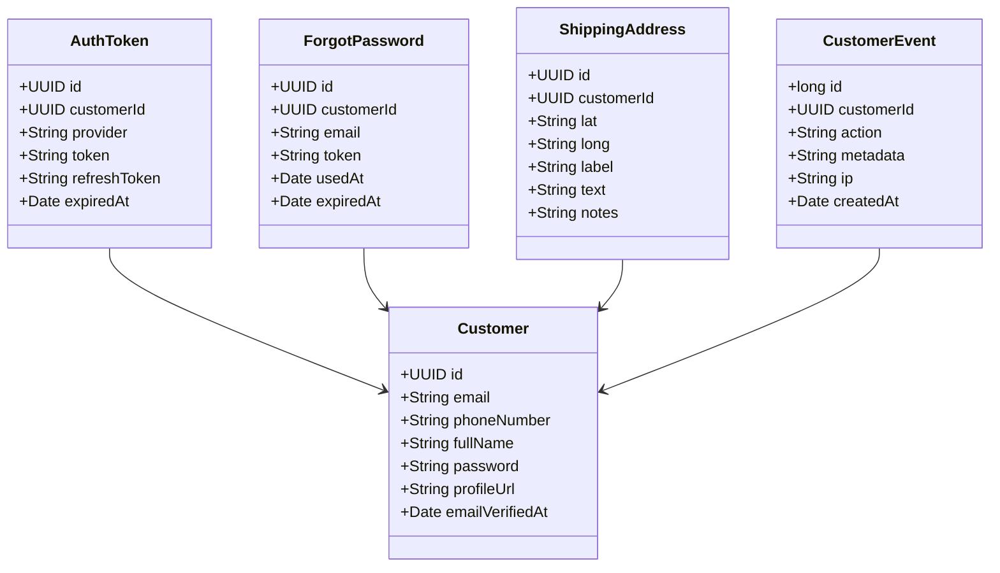

# Task Answer

## Task #1

For the purpose of this task, Customer class implementation can be found [here](https://github.com/vekaputra/gt-ecom/blob/master/src/main/java/com/gtda/ecom/customer/Customer.java)

## Task #2

On this task, the customer table is a simple one with this fields to support task #3 and #4



With proper consideration for ecommerce app later, it might look more like this



`CustomerEvent` will provide ability to record all user action such as login, update data, auth token usage, etc

`ShippingAddress` will provide ability to record multiple shipping address to send purchased item without the need to input each address on every purchase

`ForgotPassword` will provide ability to do forgot password flow multiple times, can be used to track suspicious user and warn original user for potential account takeover

`AuthToken` will provide ability to handle oauth2 login using not only own authentication service, but multiple social login as well to make it easier for user onboarding

## Task #3

The implementation of forgot password flow can be found [here](https://github.com/vekaputra/gt-ecom/blob/ba7bacf5747fbd7145c82c1fb913cf0068df757f/src/main/java/com/gtda/ecom/auth/AuthController.java#L84-L119)

The flow of user that forgot their password will be like this:

1. User will provide valid `email` to `POST /api/password/forgot` endpoint
2. Server will generate forgot password token and the url to update password then return it as response
3. User will use update password url given in step 2, and fill required data to update their password (email, password and confirmPassword)
4. Server will check if email and forgot password token is correct, if it's correct then proceed to update user password

Since this is a test, the user flow is not a proper way to handle this. The proper way in my opinion will be like this:

1. On Step 2, instead of returning forgot password token and the url to update password as response, it will be sent via email instead
2. If it's possible to record customer phone number, using SMS OTP will be another good way to replace forgot password token as it's more secure
3. Forgot password token should have expiry time, so it can not be used after certain times

To test this endpoint, the steps are:

1. Call `POST http://localhost:8080/api/auth/signup` endpoint with payload as follow
```
    {
        "email": "john.doe@gmail.com",
        "fullName": "john doe",
        "password": "johndoe8",
        "confirmPassword": "johndoe8"
    }
```
2. Call `POST http://localhost:8080/api/auth/login` endpoint to check if customer created successfully with payload
```
    {
        "email": "john.doe@gmail.com",
        "password": "johndoe8"
    }
```
3. Call `POST http://localhost:8080/api/auth/password/forgot` endpoint to trigger forgot password flow with payload
```
    {
        "email": "john.doe@gmail.com"
    }
```
4. it should return url like `http://localhost:8080/api/auth/password/update/wosbuolloxjjytkrgviwtkvlkfbeagth` with forgot password token with length 32
5. Call `PUT http://localhost:8080/api/auth/password/update/wosbuolloxjjytkrgviwtkvlkfbeagth` with following payload
```
    {
        "email": "john.doe@gmail.com",
        "password": "newpass8",
        "confirmPassword": "newpass8"
    }
```

## Task #4

To query list of customer who login for past 7 days (or past x day / week / hour) can use findAllActiveCustomersSince function that can be found [here](https://github.com/vekaputra/gt-ecom/blob/ba7bacf5747fbd7145c82c1fb913cf0068df757f/src/main/java/com/gtda/ecom/customer/CustomerRepository.java#L13)

The query is `SELECT * FROM customers c WHERE c.last_login_at >= ?1`

To test this endpoint, can try to call this endpoint `GET http://localhost:8080/api/customers/active?lastLoginAt=2022-12-20 00:00:00` after login and put `Authorization: Bearer <authToken>` on header. it should return all customer with login history after 2022-12-20